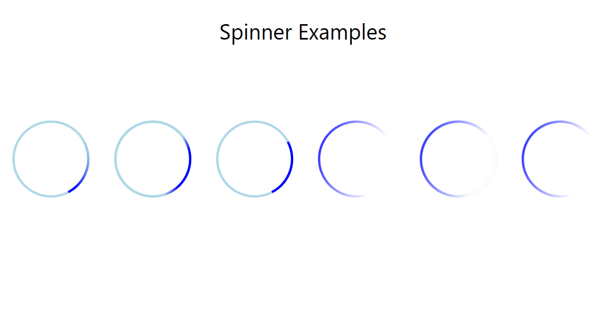

# WpfSpinnerExamples

Some simple examples of an animated "busy" spinner done with XAML and WPF.

Here is what they look like.

*Note: The framerate on the gif isn't the best. They animate more smoothly in reality.*
